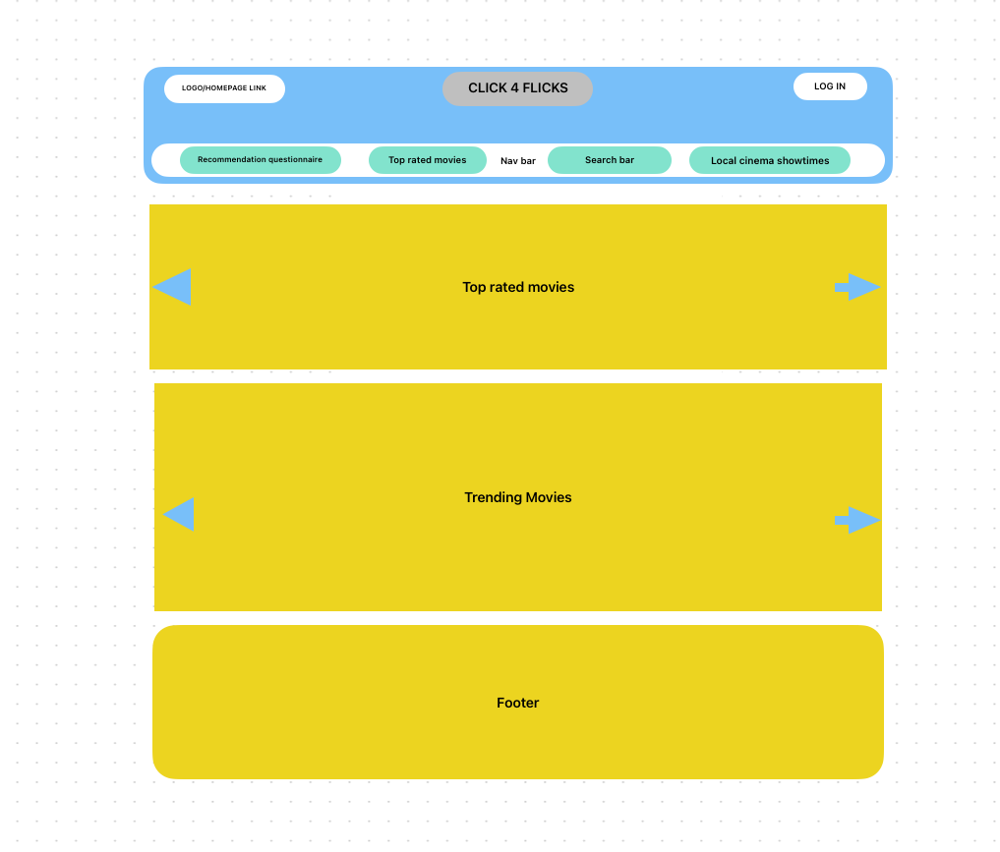
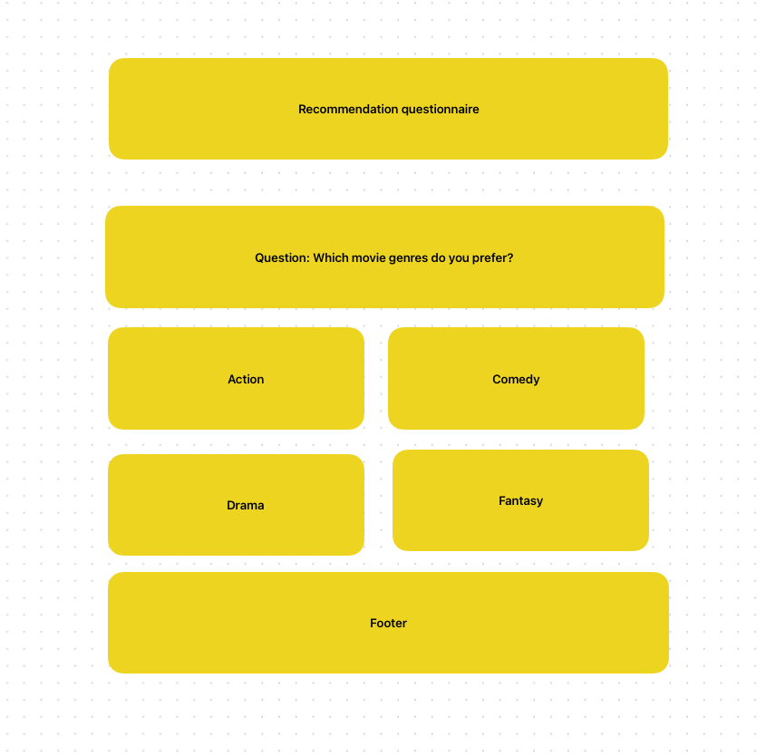
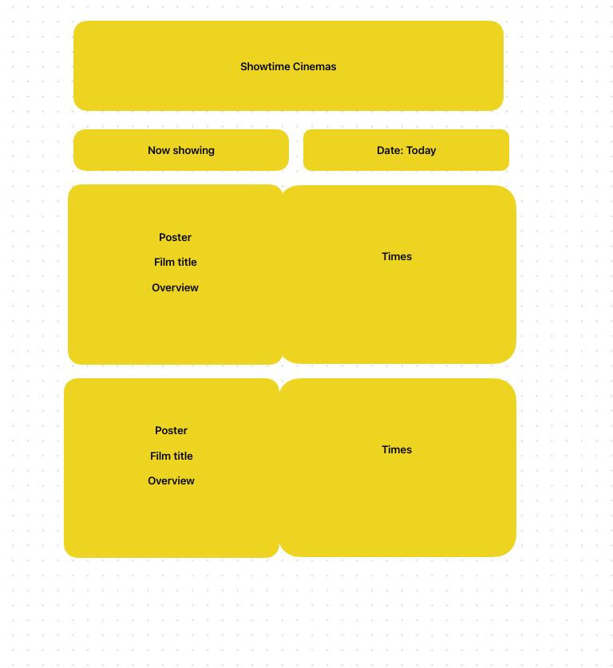
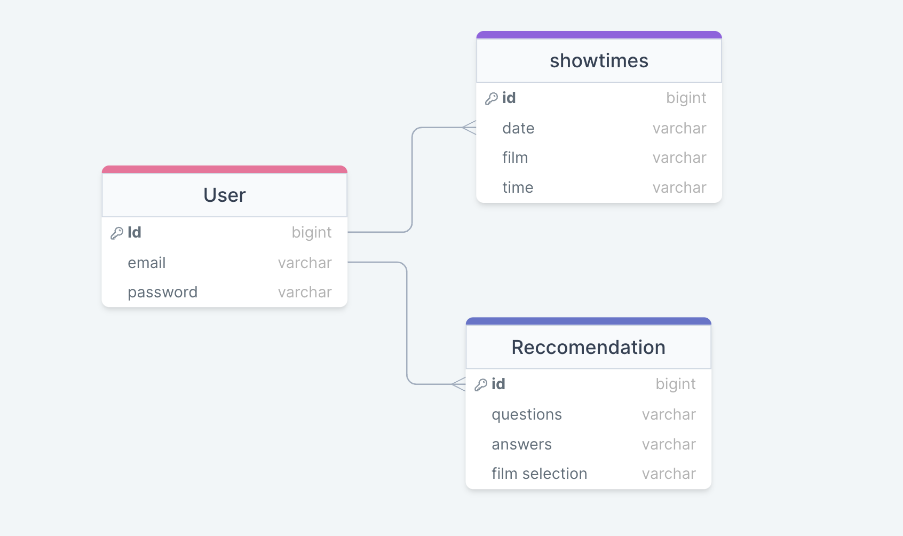

# CLICK 4 FLICKS

## Overview

Idea of my app is for my users to browse my website for various genres of movies. Can also complete a questionnaire to recommend genres/films that we think you would like. Also links to upcoming trailers, most streamed films and reviews of the latest films out now. A showtimes tab in the nav bar with showtimes of your local cinema.

### Problem

Why is your app needed? Background information around any pain points or other reasons.

My app would end up being a central hub for a users movie experience. All the information they would need would be on my website. Whether that is a list of genres, the latest films out on that particular week and if they are films they are interested in they can find local showtimes in there area instead of having to look on a different website.

### User Profile

Who will use your app? How will they use it? Any special considerations that your app must take into account.

Movie junkies:

- Looking for any movies you require (searchbar or genre a-z in navbar).
- questionnaires for recommendations (netflix and chill sessions) for at home or on holiday (logging into user profile will store these).
- Looking for upcoming films and showtimes for your local cinema (friday night date night).

### Features

List the functionality that your app will include. These can be written as user stories or descriptions with related details. Do not describe _how_ these features are implemented, only _what_ needs to be implemented.

- As a user, I want to find any movie I want and by clicking on that movie I can see the reviews (stars), what platform you can watch said film on (netflix, amazon etc).
- As a user, I want to complete a questionnaire of various questions that will give me recommendations for films you would like - will have a log in button top right to store.
- As a user, I want to see new/upcoming films with trailers and reviews. If I want to see these films I can find showtimes of said films at various local cinemas.
- As a user, I would like to get back to the homepage by clicking on the website header or logo.
- As a user I would like a searchbar to make it easier to find a particular film I want to watch.

## Implementation

### Tech Stack

List technologies that will be used in your app, including any libraries to save time or provide more functionality. Be sure to research any potential limitations.

- React
- Javascript
- MySql
- Client libraries:
  - react
  - react-router
  - axios
- Server libraries:
  - knex
  - express

### APIs

List any external sources of data that will be used in your app.

Movie DB API

### Sitemap

List the pages of your app with brief descriptions. You can show this visually, or write it out.

- Home page
- Top rated movies
- Recommendations film Questionnaire
- Showtimes at Local Cinemas

### Mockups

Provide visuals of your app's screens. You can use tools like Figma or pictures of hand-drawn sketches.

### Data

Database for Questionnaire have been created

Database for Cinema showtimes have been created

### Endpoints

List endpoints that your server will implement, including HTTP methods, parameters, and example responses.

**GET /movies/top_rated**

Response:

[
{
"id": 278,
"poster_path": "/9cqNxx0GxF0bflZmeSMuL5tnGzr.jpg"
"original_title": "The Shawshank redemption",
"release_date": "1995-02-17",
},
...
]

**GET /movies/top_rated/:id**

[
{
"id": 278,
"backdrop_path": "/kXfqcdQKsToO0OUXHcrrNCHDBzO.jpg",
"original_title": "The Shawshank Redemption",
"overview": "Framed in the 1940s for the double murder of his wife and her lover, upstanding banker Andy Dufresne begins a new life at the Shawshank prison, where he puts his accounting skills to work for an amoral warden. During his long stretch in prison, Dufresne comes to be admired by the other inmates -- including an older prisoner named Red -- for his integrity and unquenchable sense of hope.",
"poster_path": "/9cqNxx0GxF0bflZmeSMuL5tnGzr.jpg"
"release_date": "1995-02-17",
"vote_average": 8.7,
},
...
]

**GET /trending/movie/week**

Response:

[
{
"id": 359419,
"poster_path": "/bXi6IQiQDHD00JFio5ZSZOeRSBh.jpg"
"original_title": "Road house",
"release_date": "2024-03-08",
},
...
]

**GET /trending/movie/week/:id**

[
{
"id": 359419,
"backdrop_path": "/39LxWqvQCsbAe0Cm2B7dtBe3Rd4.jpg",
"original_title": "Roadhouse",
"overview": "Ex-UFC fighter Dalton takes a job as a bouncer at a Florida Keys roadhouse, only to discover that this paradise is not all it seems.",
"release_date": "2024-03-08",
"vote_average": 7.27,
},
...
]

### Auth

Does your project include any login or user profile functionality? If so, describe how authentication/authorization will be implemented.

N/a. will be on my nice to haves

## Roadmap

Scope your project as a sprint. Break down the tasks that will need to be completed and map out timeframes for implementation. Think about what you can reasonably complete before the due date. The more detail you provide, the easier it will be to build.

- Create client

  - react project with routes and boilerplate pages

- Create server

  - express project with routing, with placeholder 200 responses

- Create migrations

- gather movie DB apis (already working in postman)

- create seeds with showtime and questionnaire data

- Feature: Top rated movies

  - implement top rated movie page
  - create GET /top_rated_movies/:Id

- Feature: Trending movies

  - implement trending movie page
  - create GET /trending/movie/week/:Id

- Feature: Questionnaire

  - implement questionnaire page
  - create GET questionnaire answers from database

- Feature: Showtimes Cinema

  - implement showtimes cinema page
  - create GET showtimes from database

- Bug fixes

- DEMO day

## Nice-to-haves

Your project will be marked based on what you committed to in the above document. Under nice-to-haves, you can list any additional features you may complete if you have extra time, or after finishing.

- User log in authentication

  - User will be able to log in with email and password.
  - User will be able to store there recommendations in their own account for future use.

- Reviews

  - create reviews on each movie page and create a post review section

- Payment authentication page after cinema time picked
